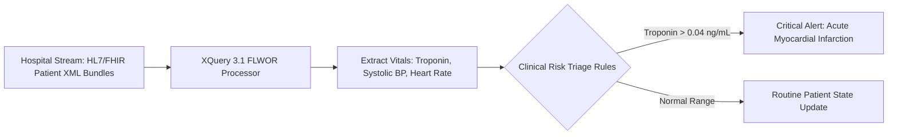

# Clinical Data Intelligence & HL7/FHIR Analytics (XQuery)

## Executive Overview
An enterprise healthcare data intelligence engine written in **XQuery 3.1**. It utilises advanced **FLWOR (For-Let-Where-Order-By-Return)** expressions to parse, query, and aggregate nested HL7/FHIR (Fast Healthcare Interoperability Resources) XML clinical bundles, automatically identifying acute patient risk indicators.

## Healthcare Stream Analytics



### Source Tree
- **`src/fhir_clinical_analytics.xq`**: Production XQuery 3.1 FLWOR script analyzing patient bundles.
- **`data/fhir_patient_bundle.xml`**: Sample HL7/FHIR XML bundle containing patient vitals.
- **`runner/run.js`**: Simulated XML/XQuery processor validating clinical triage decisions.

## XQuery FLWOR Query Excerpt
```xquery
for $entry in /Bundle/entry[resource/Observation]
let $obs := $entry/resource/Observation
where $obs/code/coding/code = "49563-0" and xs:decimal($obs/valueQuantity/value) > 0.04
return
  <Alert severity="CRITICAL" patient="{$obs/subject/reference/@value}">
    Elevated Cardiac Troponin I: {$obs/valueQuantity/value/string()} ng/mL
  </Alert>
```

## Native XQuery Execution with Saxon
```bash
java -cp saxon-he.jar net.sf.saxon.Query -q:src/fhir_clinical_analytics.xq -s:data/fhir_patient_bundle.xml
```

## Universal Verification
```bash
node runner/run.js
node orchestrator/run.js --project=39-xquery
```

## Senior Interview Q&A
- **Q: Why XQuery for healthcare data?** HL7/FHIR standards are deeply nested, hierarchical documents. Relational databases require complex normalization across dozens of tables. XQuery operates directly on the native hierarchical tree using XPath navigation, executing queries with high performance.
- **Q: How does XQuery handle schema evolution?** XPath navigates by tag structure; adding optional fields or metadata to FHIR resources does not break existing XQuery expressions, preserving backward compatibility.\n
